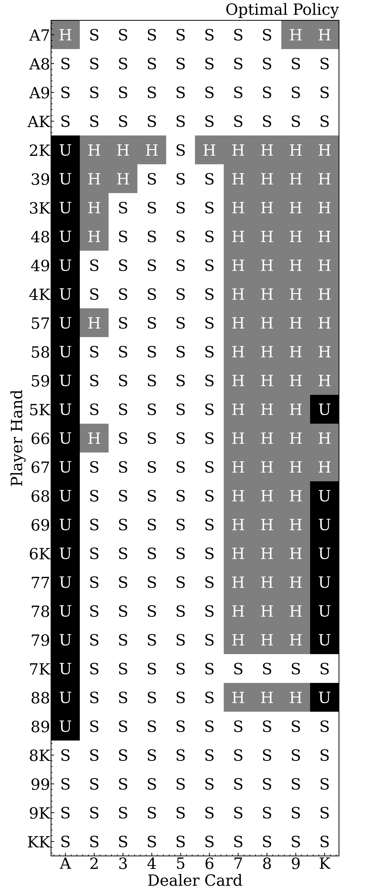

## Blackjack solver

A Full Blackjack solver, considering the player's full hand composition and the deck composition.

### The Game [(Wiki)](https://en.wikipedia.org/wiki/Blackjack)

Blackjack is a popular casino card game for 1 or more players where the players compete against the card dealer, who has a predefined strategy. We focus on the 1-player game.

The player is dealt two cards face up, and the dealer is dealt one card face up. The player then takes one of several actions (Hit, Stand, Double Down, Split, Surrender). Once the player "stands", it's the dealer's turn to play.

The player's goal is to have a hand score closer to 21 than the dealer's hand, without exceeding 21.

### The Goal

Before revealing any card, we have placed a bet of $`\$1`$, and the possible outcomes of the game are winning ($`+\$1`$), drawing ($`\$0`$), and losing ($`-\$1`$).

A *strategy* is a choice of what action to take for any hand we may have and any upcard the dealer may have.

Once a strategy is chosen, we can calculate the expected outcome or value ($\text{EV}$) of the bet, averaging over all possible games while following that strategy:

```math
\begin{equation}
\text{EV} = +\$1 \times P(\text{player wins}) -\$1 \times P(\text{player loses}),
\end{equation}
```

where $P(...)$ is the probability of an event. Our goal is to determine the *optimal strategy*, the strategy that maximizes $\text{EV}$. This involves calculating the $\text{EV}$ of all possible actions for every possible game state, which can be done efficiently through a [dynamic programming](https://en.wikipedia.org/wiki/Dynamic_programming) algorithm.

### Blackjack solver - rough outline

The steps to determine an optimal policy using dynamic programming:

1. **Specify parameters and initial deck:** Only the numerical score of cards matter, not their suit. The deck is specified by the number of cards of each score. Example:

```math
\begin{equation}
\text{deck} = \{\text{"Ace"} = 3, "2" = 4, ..., "10" = 15\}.
\end{equation}
```

2. **List valid hands:** List all hands that have not busted, including empty and 1-card hands. Similarly to the deck, we care only about numerical score:

```math
\begin{equation}
\begin{split}
& \text{hand} = \{\text{``10"} = 1\}, \\
& \text{hand} = \{\text{``2"} = 1, \text{``3"} = 1, ``8" = 1\}, \\
& \text{hand} = \{\text{``Ace"} = 2, ``10" = 1\},
\end{split}
\end{equation}
...
```

3. **Resolve the dealer's strategy:** Find the probability

```math
\begin{equation}
P(\text{dealer stands at } D | \text{player's hand}, \text{dealer's upcard}),
\end{equation}
```

that the dealer will stand with a total score

```math
\begin{equation}
\text{TARGET} \le D \le \text{BLACKJACK}.
\end{equation}
```

for each player hand and each revealed dealer's card. The probability that the dealer exceeds $\text{BLACKJACK}$ is then

```math
\begin{equation}
P_{\text{s}}(\text{dealer busts}) = 1 - \sum_{D} P_{\text{s}}(\text{dealer stands at } D),
\end{equation}
```

where $P_{\text{s}}(...)$ is the probability of an event conditioned on the current game state $\text{s} = (\text{player's hand}, \text{dealer's upcard})$.

4. **Navigate state tree:** The optimal strategy for each state $(\text{player's hand}, \text{dealer's upcard})$ can be determined in one sweep of all states, going backwards from the largest hand size states to the lowest.

The $\text{EV}$ of standing at state $(\text{player's hand}, \text{dealer's upcard})$ is

```math
\begin{equation}
\begin{split}
& \text{EV}_{\text{stand}}(\text{player's hand}, \text{dealer's upcard}) = P_{\text{s}}(\text{dealer busts}) \\
& + P_{\text{s}}(\text{player's score} > \text{dealer's score}) - P_{\text{s}}(\text{player's score} < \text{dealer's score}) = \\
& = P_{\text{s}}(\text{dealer busts}) + \sum_{D} \text{sgn}(\text{player's score} - D) \times P_{\text{s}}(\text{dealer stands at } D)
\end{split}
\end{equation}
```

where $\text{sgn}(x)$ is the sign function. The $\text{EV}$ of hitting (getting one more card) is

```math
\begin{equation}
\begin{split}
& \text{EV}_{\text{hit}}(\text{player's hand}, \text{dealer's upcard}) = \\
& \sum_{\text{c}} P_{\text{s}}(\text{draw } c) \times \text{EV}_{\text{opt}}(\text{player's hand} \cup \{c\}, \text{dealer's upcard}) 
\end{split}
\end{equation}
```

where we sum over card scores and where $\text{EV}_{\text{opt}}$ is the $\text{EV}$ of the optimal strategy. If the player busts, $\text{EV} = - 1$.

### Parameters

- Deck (default: standard single deck)
- Blackjack score: (default: $\text{BLACKJACK}=21$)
- Dealer's target (lowest amount the dealer stands on) (default: $\text{TARGET}=17$).
- Ace alternate extra score. Base score is 1. (default: $\text{ACE}_+=10$)

### TODO

Some actions and rules are not yet implemented. Currently:
- The dealer always stands on reaching soft target (No hit on soft).
- The dealer cannot peek.
- The player cannot double down.
- The player cannot split.

### Solutions

For the parameters specified above: $\text{EV}_{\text{opt}} = -0.0375$. Below is the player's optimal strategy for every possible starting state. "H" is hit. "S" is stand. "U" is surrender. For two-card hands not shown, the strategy is always to hit.



